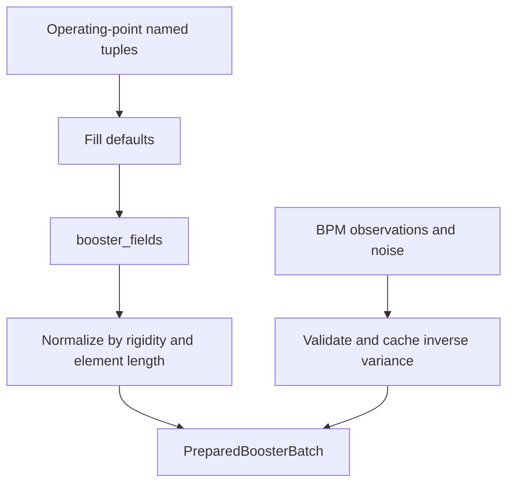

# Booster UQ backend workflow

This guide maps the source tree and follows one likelihood-and-gradient call
through preparation, closed-orbit solving, tracking, implicit differentiation,
and reduction. The public interface and deployment recommendations are in
[BOOSTER_UQ_API_GUIDE.md](BOOSTER_UQ_API_GUIDE.md).

## 1. Source map

| File | Responsibility |
|---|---|
| [`booster_batched_uq.jl`](../booster_batched_uq.jl) | Defines the CPU module, exports the public API, and includes the CPU implementation files |
| [`booster_uq_preparation.jl`](../booster_uq_preparation.jl) | Compiles operating points, observations, and noise into `PreparedBoosterBatch` |
| [`booster_uq_workspaces.jl`](../booster_uq_workspaces.jl) | Defines sensitivity options, CPU problem types, persistent primal/JVP storage, lattice construction, and CPU backend constructors |
| [`booster_uq_orbit.jl`](../booster_uq_orbit.jl) | Supplies common tracking, batched references, CPU SciBmad orbit integration, and BPM sampling |
| [`booster_scibmad_reference.jl`](../booster_scibmad_reference.jl) | Specializes SciBmad residual construction so batched rigidity and reference time reach `Bunch` correctly |
| [`booster_uq_inference.jl`](../booster_uq_inference.jl) | Implements the shared evaluation skeleton, CPU likelihood, implicit gradient, ChainRules rules, and Turing model |
| [`cuda/booster_batched_uq_cuda.jl`](../cuda/booster_batched_uq_cuda.jl) | Defines CUDA problem storage, device staging and reductions, CUDA methods for the generic API, status handling, and compatibility aliases |
| [`cuda/booster_scibmad_cuda.jl`](../cuda/booster_scibmad_cuda.jl) | Selects the CUDA orbit implementation by precision and extracts SciBmad's sparse `I-R` layout on device |
| [`booster_gpu_common.jl`](../booster_gpu_common.jl) | Shared Metal/CUDA kernels for the custom orbit path, lane-local linear solves, parameter seeding, implicit response, and factor reductions |
| [`metal/booster_batched_uq_metal.jl`](../metal/booster_batched_uq_metal.jl) | Experimental Metal frontend |
| [`metal/booster_metal_device.jl`](../metal/booster_metal_device.jl) | Metal-specific BeamTracking compatibility and device methods |
| [`tests/`](../tests/) | CUDA and Metal validation suites |
| [`benchmarks/`](../benchmarks/) | CPU, CUDA, and Metal benchmark programs, runners, plots, and reports |

## 2. Module and dispatch structure

`BoosterBatchedUQ` owns the generic operations:

```julia
batch_problem
value_and_gradient!
factor_batch_value_and_gradient!
booster_loglikelihood
booster_factor_batch_loglikelihoods
```

The CUDA module includes that CPU module as `BoosterBatchedUQCUDA.UQ`, imports
the generic functions, and adds methods for CUDA problem and array types.
Dispatch therefore selects the backend at the operation boundary:

| Stage | CPU method | CUDA method |
|---|---|---|
| Construction | `batch_problem(..., CPU())` | `batch_problem(..., CUDABackend())` |
| Factor preparation | CPU array validation and in-place broadcast | Host/device staging plus CUDA quadrupole kernel |
| Closed orbit | SciBmad on CPU arrays | SciBmad on Float64 CUDA arrays; custom device Newton for Float32 |
| Likelihood | CPU tracking and scalar reduction | CUDA tracking and factor reduction kernel |
| Gradient | CPU ForwardDiff passes and `\` | CUDA ForwardDiff kernels and lane-local `_row_solve!` |
| Result | CPU scalar/vector | Device arrays for device input; copied host values for host input |

The `cuda_*` operation names at the bottom of
`cuda/booster_batched_uq_cuda.jl` are constants bound to these generic functions.
They do not contain separate likelihood or gradient implementations.

The current nested-module arrangement is a source-tree loading mechanism, not
the desired final package structure. A future Julia package should load the CPU
module once and put CUDA methods in a package extension.

## 3. The three batch axes

Let:

- `S` be the number of physical experiments;
- `F` be the number of independent factor vectors; and
- `C` be the ForwardDiff chunk width.

For one factor vector, tracking arrays have `S` rows. For a factor problem they
have `S × F` rows, ordered as:

```text
row(factor, experiment) = experiment + S * (factor - 1)
```

Every factor row gets its own closed orbit for every experiment. ForwardDiff
partials remain local parameter columns within each row. No derivative couples
one factor vector to another.

An inference chain is outside these axes. It owns a complete mutable problem
and calls it repeatedly. Several chains require several workspaces or several
processes.

## 4. One-time dataset preparation

`prepare_booster_batch` performs the work that does not depend on the inferred
quadrupole factors:



For each experiment it computes:

- lane-dependent reference rigidity;
- normalized dipole orders;
- 48 main-quadrupole base strengths;
- sextupoles, all 24 horizontal and 24 vertical correctors, the AC quadrupole,
  and fast magnets;
- observed BPM positions and inverse variances; and
- the Gaussian normalization constant.

The nonlinear current-to-field conversion runs here, once. A likelihood call
only multiplies the 48 prepared quadrupole columns by the proposed factors.

## 5. Persistent problem construction

Problem construction deep-copies the unpowered Booster lattice and installs
`BatchParam` views into structure-of-arrays storage. Main quadrupoles point to
columns of the mutable `quad_active` matrix. Changing that matrix changes what
the next track sees without rebuilding lattice elements.

Each CPU `BoosterBatchProblem` owns:

- a primal lattice and floating-point `quad_active` matrix;
- closed-orbit guess, solution, BPM prediction, and residual weights;
- the lane-local `4 × 4` fixed-point matrix;
- a second lattice whose active quadrupoles and coordinates carry
  fixed-width `ForwardDiff.Dual` values; and
- tangent orbit, BPM samples, and implicit-response buffers.

A factor problem repeats prepared experiment rows `F` times during
construction and wraps one expanded workspace. CUDA construction performs the
same logical construction using device arrays and adds persistent device
factor, result, failure, and orbit-solver buffers.

The stored `BatchParam` views are why the lattice does not need to be rebuilt
for every proposal.

Corrector columns use `CORRECTOR_NAMES = (H_CORRECTOR_NAMES...,
V_CORRECTOR_NAMES...)`. Every horizontal column, including `DHCD6` and
`DHCF6`, is installed as a normal integrated dipole strength. Every vertical
column is installed as a skew integrated dipole strength. Scalar lattice
configuration in `booster_lattice/booster_setting.jl` uses the same complete
mapping.

## 6. Shared evaluation skeleton

All problem types enter `UQ._evaluate_core!`:

```text
_with_workspace(problem) do
    _prepare_factors!(problem, factors)
    _solve_orbit!(problem, factors)
    values = _likelihood!(problem)
    gradient_requested ? (values, _gradient!(problem, factors)) : values
end
```

`_with_workspace` rejects concurrent use of the same mutable problem. CUDA's
method also synchronizes before releasing the workspace.

The internal stage names are shared. CPU and CUDA specialize only the work
that depends on storage or execution backend.

## 7. Factor preparation

For one factor vector, active strengths are:

```text
quad_active[S,48] = quad_k1_base[S,48] .* factors[1,48]
```

For a factor batch:

```text
quad_active[S*F,48] =
    repeated_quad_k1_base[S*F,48] .* factors[F,48]
```

CPU uses array loops and broadcasts. CUDA copies host factors into persistent
device storage when necessary, validates device factors, and launches
`_set_active_quadrupoles_kernel!`. A `CuArray` input takes the device-to-device
staging path.

## 8. Closed orbit and `I-R`

For each lane, the coasting transverse closed orbit satisfies:

```math
x^*(q) = M(x^*(q), q), \qquad x \in \mathbb{R}^4.
```

The longitudinal coordinates are fixed for this Booster workflow. The
coordinate derivative of the one-turn map is:

```math
R = \frac{\partial M}{\partial x}.
```

### CPU

`_solve_updated_primal!` calls:

```julia
SciBmad.find_closed_orbit(
    lattice;
    v0=closed_orbit,
    coasting_beam=true,
    batch=Val(true),
    rf_on=false,
    ...,
)
```

SciBmad and BatchSolve use AutoBatch to form independent coordinate Jacobians
for all experiment rows. SciBmad defines its residual as `x - M(x)`, so the
returned residual Jacobian is already `I-R`. The code copies its sparse values
into `fixed_point_lhs[lane,4,4]`.

`booster_scibmad_reference.jl` fixes a general reference-construction issue:
SciBmad's default residual constructs a `Bunch` with scalar reference fields,
while this lattice has lane-dependent `BatchParam` rigidity. The specialized
residual constructs the `Bunch` using `_reference(lattice, cache)`, including a
batched reference time when necessary.

### CUDA Float64

The same `SciBmad.find_closed_orbit` call operates on CUDA arrays. BatchSolve's
CUDA path performs its batched Newton linear algebra on the GPU. The
`_scibmad_lhs_kernel!` kernel converts SciBmad's AutoBatch sparse storage into
the persistent dense lane-local `I-R` array without staging that matrix through
the host.

SciBmad still synchronizes for Newton convergence decisions. The computation
and state remain on the GPU, while Julia retains control of the iteration.

### CUDA Float32

Float32 currently dispatches to `_solve_device_orbit!` in
`booster_gpu_common.jl`. It seeds four coordinate duals, tracks one turn,
constructs each lane's residual and `I-R`, solves a `4 × 4` Newton update with
the KernelAbstractions `_row_solve!` kernel, and records per-lane convergence.
This path is experimental; production CUDA currently uses Float64 and SciBmad.

## 9. BPM likelihood

After convergence, `_predict_primal!` copies the closed orbit into the tracking
state and calls `_track!`. Tracking remains element-by-element because BPM
coordinates must be sampled at selected element boundaries. RF is disabled.

`_track!` constructs the `Bunch` with the lattice's scalar or batched reference
and calls native `BeamTracking.track!` for every element. At each selected BPM,
it stores either the horizontal or vertical coordinate. The predictions are
converted from metres to millimetres.

The Gaussian log likelihood is:

```math
\log L = C - \frac{1}{2}\sum_{e,b}
    \left(y_{e,b}-\hat y_{e,b}\right)^2\sigma_{e,b}^{-2}.
```

The weighted residual is retained because the gradient reduction needs it.
CUDA performs one reduction per factor vector in
`_factor_likelihood_kernel!`.

## 10. Implicit parameter gradient

The implementation differentiates the fixed-point equation rather than the
Newton algorithm. For one parameter chunk:

```math
(I-R)\frac{dx^*}{dq} = \frac{\partial M}{\partial q}.
```

The steps are:

1. Seed up to `C` quadrupole parameters in the JVP lattice.
2. Put zero parameter partials on the converged scalar orbit.
3. Track one turn to obtain the fixed-coordinate map derivative
   `∂M/∂q`.
4. Solve the lane-local `4 × 4` system with `C` right-hand sides to obtain
   `dx*/dq`.
5. Seed `dx*/dq` into the initial coordinates while retaining the parameter
   seeds in the magnets.
6. Track through the BPMs. These dual BPM coordinates now contain the total
   derivative, including direct magnet response and orbit displacement.
7. Contract the BPM tangents with the stored weighted residuals and write the
   corresponding gradient columns.

CPU currently materializes each lane's small matrices and uses Julia's `\`.
CUDA uses `_row_solve!`, one independent KernelAbstractions work item per lane.
The CUDA solve contains ordinary scalar loops inside each lane; it does not use
the CPU `@simd` solver.

This sequence repeats `ceil(48/C)` times. It never differentiates through
SciBmad's Newton iterations and never forms a full `(33S) × 48` BPM Jacobian.

## 11. AD boundary

`booster_loglikelihood` calls the explicit forward/implicit gradient and
provides a ChainRules pullback. The pullback multiplies the stored gradient by
the upstream scalar cotangent. For a factor batch, every output cotangent
weights its corresponding gradient row.

This boundary prevents reverse AD from tracing through:

- mutable tracking workspaces;
- BeamTracking element loops;
- SciBmad and BatchSolve Newton iterations; and
- the implicit small linear systems.

The CPU module additionally registers ReverseDiff bridges and provides the
Turing `booster_model` wrapper.

## 12. Host and device boundaries

“Device-resident” means the numerical state and major calculations remain in
CUDA arrays after construction. It does not mean the GPU executes an autonomous
graph:

- Julia launches BeamTracking once per lattice element.
- SciBmad makes host-visible convergence decisions.
- host factor inputs are copied to the device;
- host-adapter calls copy results and status back; and
- some BeamTracking reference comparisons currently cause scalar Boolean
  reductions and one-byte device-to-host copies.

The Nsight capture found many short kernel launches, asynchronous allocations,
stream synchronizations, and small device-to-host transfers. The lane-local
`4 × 4` solve consumed negligible time. The most valuable CUDA work is therefore
reducing launch count, caching temporary storage, and removing avoidable
host-visible reference checks. Replacing `_row_solve!` would not materially
change end-to-end performance.

## 13. Extending or debugging the backend

Use the following order when locating a failure:

1. **Input or calibration:** inspect `prepare_booster_batch` and
   `booster_lattice/booster_conversions.jl`.
2. **Wrong magnet value:** inspect `quad_active`, the prepared base column, and
   `_prepare_factors!`.
3. **Closed-orbit failure:** inspect `device_status`, SciBmad return codes,
   `closed_orbit`, and `fixed_point_lhs`.
4. **BPM mismatch:** compare `_predict_primal!` output before likelihood
   reduction.
5. **Gradient mismatch:** compare `I-R`, the first fixed-orbit tangent pass,
   the implicit response, and then the moving-orbit BPM tangent pass.
6. **CUDA-only failure:** first test kernel argument adaptation and the direct
   SciBmad orbit stage in `tests/test_batched_uq_cuda.jl`.

Backend-specific behavior should normally be added as a method on a shared
stage or public operation. Add a backend-prefixed public function only when the
operation has no meaningful backend-neutral contract. Keep compatibility
aliases thin and route them through the dispatched implementation.

## 14. Normalized multipole fast path

The prepared Booster lattice stores normalized, non-integrated, zero-tilt
multipoles. Specialized `get_strengths` methods avoid BeamTracking's generic
rotation, rigidity-normalization, and length-conversion arithmetic for both
the `BMultipoleParams` container and the scalar `BMultipole` produced by
quadrupole indexing. This is useful when those otherwise inactive operations
would be repeated for every lane with wide `ForwardDiff.Dual` values.

Disable the specialization for a controlled comparison:

```sh
BOOSTER_UQ_DISABLE_NORMALIZED_FASTPATH=1 julia --project=. \
    benchmarks/benchmark_normalized_fastpath.jl
```

On the reference M-series machine, the complete fast path improved median
time by about 1.8--2.0% and reduced measured allocation volume by roughly
15--20%. Its main benefit is lower memory pressure; it accounts for only a
small part of the improvement from batched execution.

## 15. Experimental Metal backend

`metal/booster_batched_uq_metal.jl` supplies the experimental Metal problem types
and methods. Closed-orbit Newton iterations, coordinate Jacobians, lane-local
4×4 solves, tracking, implicit sensitivities, and likelihood reductions use
persistent Float32 Metal arrays. Julia constructs the lattice, launches
kernels, checks convergence, and returns results to the host. Metal-specific
BeamTracking compatibility methods are isolated in
`metal/booster_metal_device.jl`.

```julia
include("metal/booster_batched_uq_metal.jl")
using .BoosterBatchedUQMetal

problem = metal_problem(prepared; chunksize=24)
loglikelihood, gradient = metal_value_and_gradient!(problem, ones(48))

factor_problem = metal_factor_problem(prepared, nfactors; chunksize=8)
loglikelihoods, gradients = metal_factor_value_and_gradient!(
    factor_problem,
    factor_sets,
)
```

Use `metal_chain_problems(prepared; nchains=Threads.nthreads())` for one
independent workspace per Julia thread. A workspace must not be entered by two
chains concurrently.

Metal is launch-bound at modest batch sizes because BeamTracking crosses its
host function boundary once per lattice element. Wider derivative chunks
reduce repeated full-lattice launches, although they also increase compilation
time and register pressure. Earlier M4 measurements favored width 24 and found
the GPU path crossing the CPU path between 1,024 and 2,048 lanes. Those
measurements predate the device-primal synchronization correction and should
be rerun before being used in a performance report.

Metal requires Float32 arithmetic for this workflow. In the earlier sweep,
likelihood relative error was about 0.11% and whole-gradient relative L2 error
was about 1.2--1.3%. CUDA supports Float64 and is the current development and
validation priority.

The lowered BeamTracking representation encodes the batch length in
`_LoweredBatchParam{N}`, so each `(batch size, chunk width)` pair can trigger a
new compilation. Removing that static batch-size parameter and reducing the
number of per-element launches are the main architectural opportunities for a
future Metal implementation.
